# STM32 Eğitimi - 001 GPIO Operasyonları

STM32 kartlarında giriş, çıkış işlemlerinden bahsedeceğiz. Bunun yanında yine GPIO operasyonlarına dahil olan EXTI harici kesmelere giriş yapacağız.

----------------------------

## Başlarken

##### GPIO (General-Purpose Input/Output) Nedir ?

GPIO, genel amaçlı giriş, çıkış pini anlamına gelir. Bu seçtiğiniz pinin dış bir kaynaktan +3.3V elektrik alabilir veya +3.3V elektrik iletebilir anlamına gelmektedir. Akım değeri de 10 - 20 mA olmasına dikkat ediniz. Gerekli ayrıntılar kendi işlemciniz için Başlangıç bölümünde paylaştığımız dokümanlardan edinilebilir.

##### GPIO Interrupts (Kesmeler) Nedir ?

Bir fabrikanın ürün bantlarının olduğunu düşünelim. Herhangi bir aksilik olması durumunda kocaman kırmızı butonlar bulunur. Sorun oluştuğunda bu butonlarla operasyon durdurulur ve kesme meydana gelir. Sorun düzeltildikten sonra ürün bantları tekrar kaldığı yerden itibaren çalıştırılır. Mikrodenetleyiciler içinde durum böyledir. Kesme işlemi gerçekleştiğinde bütün işi durdurup, kesme içerisindeki kodlar çalıştırılır. Kesme kodları bittikten sonra döngü içerisinde kaldığı yere gelip, kodlarını çalıştırmaya devam eder. Kesmeleri butonlar yardımıyla da tetikleyebiliriz.

---

## GPIO CubeMX Ayarları

Başlangıç dokümanınında temel bir proje oluşturmayı görmüştük. Tekrar aynı yöntemi izleyerek yeni bir proje oluşturalım. Bu sefer harici osilatörümüzü bağlayacağız. İlk başta HSE osilatörümüzü aktif etmek için **System Core --> RCC --> HSE --> Cyristal/Ceramic Resonator** seçeneğini aktif ediyoruz. İlgili pinlerin yeşile döndüğünü ve aktif olduğunu görmüşsünüzdür.

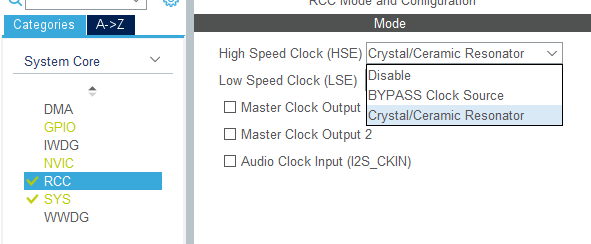

Her ne kadar aktif etmesek bile kendi otomatik aktif etse de bu seçeneği de göstermek istiyorum. Mikrodenetleyicinin bilgisayarla bağlantı kurup, çalıştıracağı kodları alabilmesi için **System Core --> SYS --> Debug --> Serial Wire** kısmını seçebilirsiniz. Tekrar bahsettiğim gibi sistem seçmeseniz bile otomatik olarak aktif ediyor. Başka sistemler kullandığınız zaman normalde bunu da aktif ettiğinizi bilmeniz için bu konuya değindim.

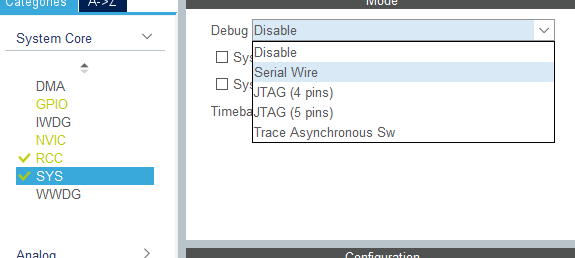

Stm32f446re kartımda bir adet kullanıcıya bırakılmış led bulunmaktadır. Benim bu ledim PA_5 piniyle bağlantılı olduğu için PA5 pinine güç çıkışı verdiğim zaman bu led yanacaktır. Sizin kullandığınız mikrodenetleyici de farklı bir pine bağlı olabileceği için mutlaka datasheetine bakmanızı öneririm. İlgili led pinini bulduktan sonra **GPIO_Output** seçeneğini seçin. Yeşil döndüğünü ve tekrar tıkladığınızda GPIO_Output seçeneğinin aktif olduğunu göreceksiniz.

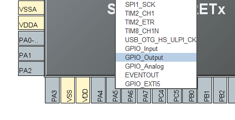

Yine System Core içerisinden GPIO'ya tıklayarak ilgili pinlerimizi listeleyebiliriz. Ben bir tane pini aktif ettiğim için sadece **PA5** pinim görünmektedir. Burda sadece hız kısmını en yüksek hız olarak değiştiriyorum, diğer genel ayarlarını olduğu gibi kullanıyorum. Bataryadan güç almadığımız için güç tüketimine dikkat etmemize gerek yok.

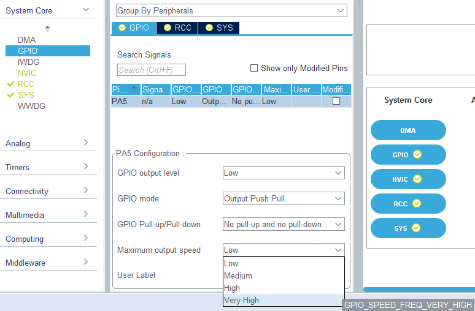

Şimdi **Clock Configuration** sekmesine geçelim ve **HSE** seçeneğini, **PLLCLK** seçeneği seçip, maksimum hızımız kaçsa mikrodenetleyicimizi o hızda çalıştıralım. Gücü bilgisayardan alacağımız için ve batarya derdimiz olmadığından istediğimiz hızı seçebiliriz. İsterseniz farklı bir değerde girebilirsiniz, PLL ve ilgili diğer ayarları CubeMX sizin için ayarlayacaktır. Benim kartımın en fazla ulaşabileceği değer 180 MHz olduğu için onu seçiyorum.

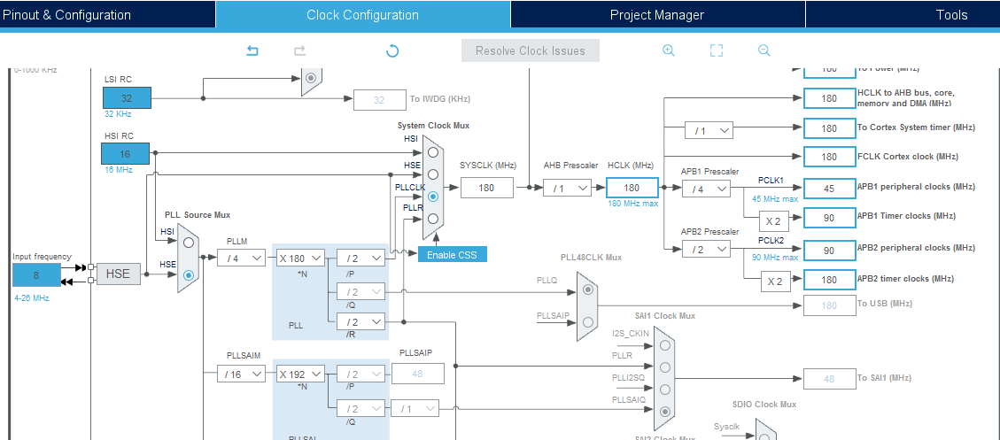

Artık **Ctrl + S** veya üstteki Generate Code seçeneğiyle kodlarımızı derleyebiliriz. Şimdi **main.c** dosyasını açalım ve Led Yakma projemize geçelim.

---

## GPIO Led Yakma (Led Blink)

Projemizi açarak, **Core --> Src --> main.c** yoluyla dosyamızı açıyoruz. Sürekli tekrar etmek istediğimiz için `while(1){` 'den hemen sonra yazıyoruz. Kısayolu **`Ctrl + Shift + F`** olan tuş kombinasyonu ile kodların satırlarını düzenli bir hale getirebiliriz. `HAL_GPIO_WritePin(GPIOA, GPIO_PIN_5, GPIO_PIN_SET);` komutu **A portundaki,** 5 numaralı pini, **SET** eder.Yani; ledimizi yakar. `HAL_Delay(1000)` komutu ise **1000 ms** yani 1 saniye bekler. Tekrar WritePin ile `GPIO_PIN_RESET` ayarını değiştirerek ledimizi söndürüyoruz ve yine 1 sn bekliyoruz.
> **UYARI :** Dikkat etmemiz gerek husus, ileride tekrar **CubeMX** kullanma ihtimalimize veya yeni özellikler eklememize karşın kodlarımızı **USER CODE BEGIN/END** yazan yerlerin arasına yazmamızdır. **CubeMX**'de tekrar **Generate Code** seçeneğini kullandığımızda bizim yazdığımız kodlara dokunmaz fakat belirtilen yerlere yazmak isek oradaki **TÜM KODLAR SİLİNİR.**

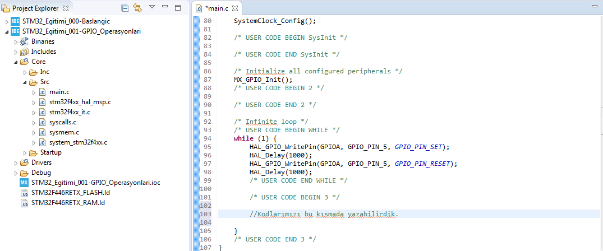

Alternatif olarak **WritePin** yerine **TogglePin** ile de aynı işlemi yapabilirdik. TogglePin ise mevcut **`Low(0) - RESET`** veya **`High(1) - SET`** durumunu tam tersi şekilde işleme koyar. Hatırlarsanız en başta CubeMX'de **PA5** pinimizin **GPIO output level** seçeneğini **LOW(0)** olarak ayarlamıştık.

```c

	/* USER CODE BEGIN WHILE */
	while (1) {
		HAL_GPIO_TogglePin(GPIOA, GPIO_PIN_5, GPIO_PIN_SET);
		HAL_Delay(1000);
		/* USER CODE END WHILE */

		/* USER CODE BEGIN 3 */
	}
	/* USER CODE END 3 */

```

Peki, bu kodları nereden bulabiliriz? İşte burada **Başlangıç** bölümünde verdiğimiz HAL kütüphane adreslerine bakmamız gerekiyor. F4 serisi için **UM1725** nolu dokümanda GPIO ile ilgili bolümlerden ulaşabiliriz.

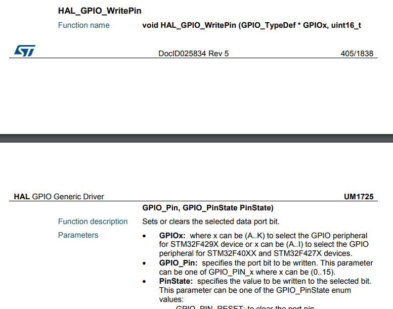
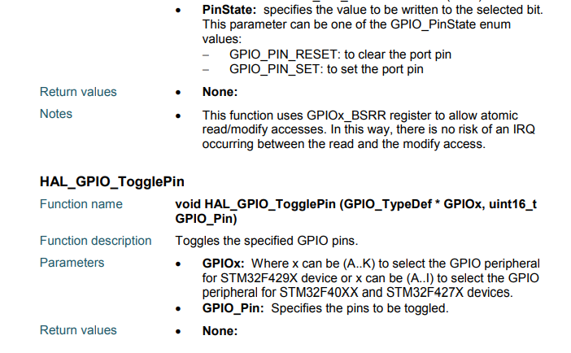

Kodlarımızı **`Debug`** seçeğiyle yükleyebileceğimiz gibi hemen yanında bulunan CubeIDE 'nin 1.3.0 ile gelen **`Run`** özelliğiyle de Debug yapmadan hemen çalıştırabiliriz. Tabi; kodlarımızda bir aksaklık olmaması için **Build** yapmanızı öneririm.

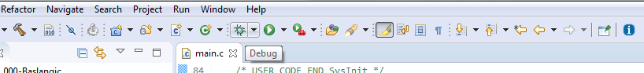

**Debug** seçeğini seçtikten sonra ilk kez proje de çalıştırdığımızdan, ayar ekranıyla karşılaşacaksınız. Varsayılan ayarlar yeterli olup, **OK** ile devam ediniz. CubeIDE 'de de ilk kez **Debug** modunu çalıştırdığımız için hangi ağ türünde kullanmak istiyorsanız, **`Güvenlik Duvarı`**'na izin vermelisiniz.

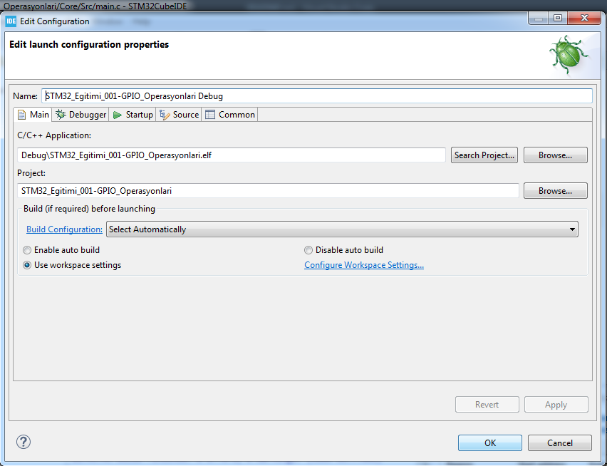

Devamında bizi **Switch** ekranı karşılayacak. **`Switch`** seçeneğiyle Debug ekranına geçiş sağlamayı onaylıyoruz. İsterseniz **`Remember my decision`** kutucuğunu işaretliyerek bir daha bu ekranın çıkmamasını sağlayabilirsiniz.

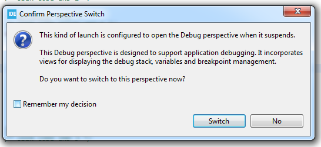

Son olarak **`Resume`** seçeneğiyle kodlarımızı mikrodenetleyicimize yükleyebiliriz. Ayrıca; bu ekran programlamada olduğu gibi Debug yapmamızı sağlar. **`Terminate`** ile de Debug işlemini sonlandırabilirsiniz.

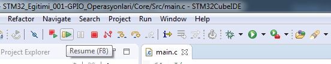

---

## GPIO Kesme Kullanımı (Interrupts)

Çok yoğun bir şekilde çalışıyorsunuz. Aniden iş ile ilgili bakmak zorunda olduğunuz bir telefon geldi. Mecburen işinizi bırakıp, telefonu yanıtlıyorsunuz. Görüşmeniz bitince tekrar işinize kaldığınız yerden devam ediyorsunuz. İşte kesmelerin çalışma mantığı bu şekildedir. Normalde kodlarımız **`while(1)`** döngüsü içerisinde çalışırken, kesme geldiğinde durdurulur ve kesme işlemi yapılır. Daha sonra kesme işlemi bittiğinde hangi kodda kaldıysa oradan devam eder.

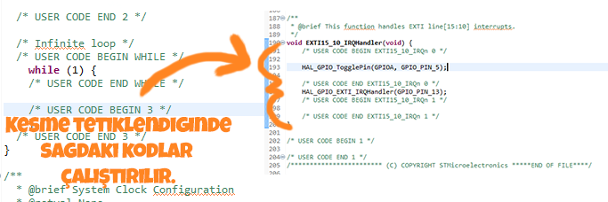

İşte size CubeIDE'yi ısrarla tavsiye etmemin en öncelikli amacı buydu. **CubeMX** programı dahili olarak içinde olduğundan **`.ioc`** uzantılı dosyayı açarak, program içerisinde değişiklikleri başka programa geçmeden yapabiliriz.

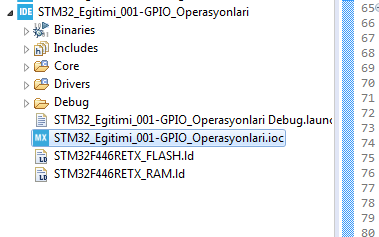

**PC13** pinine tıklayıp, **GPIO_EXTI13** seçeneğini aktif hale getiriyoruz. Bunu yaptığımızda solda gördüğünüz GPIO menüsüne **PC13** eklenecek ve **NVIC** ayarları menüsü de aktif hale gelecektir.

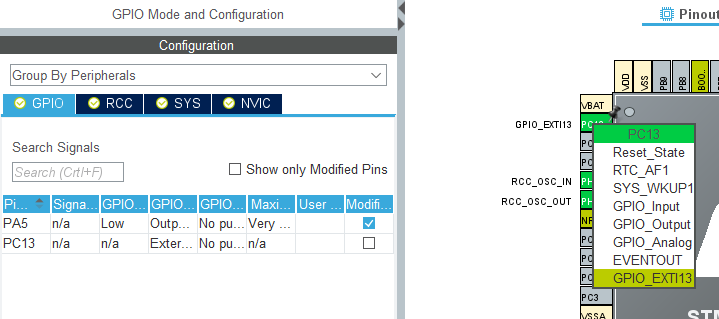

Varsayılan olarak **Rising** ayarı gelmektedir. (Bu konu hakkında pek bilginiz yoksa, internetten ufak bir araştırma yapmanızı öneririm.)

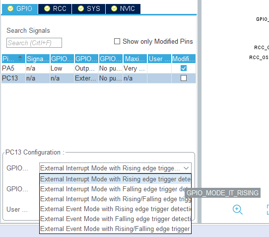

**GPIO --> NVIC** sekmesine geldiğimizde kesmemizi **Enabled** seçeneğiyle aktif hale getirmemiz gerekiyor. Yoksa kesme ayarlarımız aktif olmaz. **Priority** seçenekleri aynı anda birden çok kesmenin çağrılması durumunda hangisinin daha öncelilikli olarak çalışmasını ayarlamak içindir.

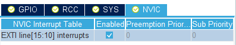

**`Ctrl + S`** seçeneğiyle kaydedince otomatik olarak karşımıza kod üretilsin seçeneği çıkar. Evet diyerek yeni kodumuzu üretiyoruz. Alternatif olarak üstteki toolbarda yer alan **Code Generation** seçeneğiyle de yeni kodlarımızı aktif hale getirebiliriz.

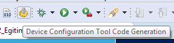

Daha önce `while(1)` döngüsü içerisine yazdığımız kodlarımızı tamamen temizliyoruz.

```c

/* USER CODE BEGIN WHILE */
	while (1) {
		/* USER CODE END WHILE */

		/* USER CODE BEGIN 3 */
	}
	/* USER CODE END 3 */

```

Soldaki panelden **Code --> Src --> `stm32f4xx_it.c`** dosyasını açıyoruz. CubeIDE' de IntelliSense (Akıllı Kod Tamamlama) özelliği bulunduğu için **HAL_GPIO_** yazdıktan sonra **`Ctrl + Space`** tuşlarına basarak **Toggle_Pin** seçeneğini daha hızlı seçebiliriz.

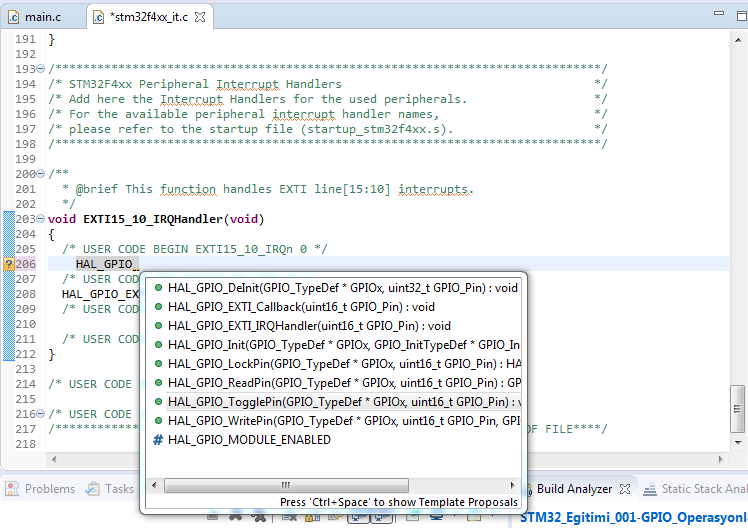

Ledimiz **PA5** pinindeydi ve başlangıç olarak sönme durumundaydı.. Amacımız kesme tetiklendiğinde bunu belli etmek için sönme durumundaysa yanmasını, yanma durumundaysa sönmesini sağlamak. Bu nedenle **`EXTI15_10_IRQHandler(void)`** fonksiyonunun ilk `/* USER CODE BEGIN EXTI15_10_IRQn 0 */` ile başlayan kısmına kodumuzu yazıyoruz.

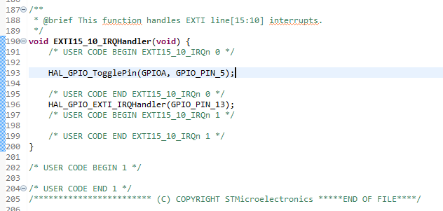

Programımızı bu sefer de **`Run`** seçeneğiyle aktardığımızda User Button (Mavi Buton - STM32F446RE kartı için PC13) ile PA5 pininin her basışta yanıp sönme durumunun değiştiğini görebiliriz. Kodlar **src** klasörü içerisindedir fakat size daha iyi öğrenmeniz adına elinizle deneyerek yazmanızı tavsiye ediyorum.
> **NOT :** Bazen butona basarken elektriksel olarak **buton arkı** oluşabilir. Bu süre gözle görülemeyecek kadar kısadır fakat işlemci bunu algılar. O nedenle bazı durumlarda size sanki yanıp sönmüyormuş gibi izlenim verebilir. Kısaca buton arkını kaldırabileceğiniz bir örnek kod uygulaması yapacağım. Buton arkı konusuyla alakalı detaylı bilgilere internet üzerinden bakabilirsiniz.

---

## GPIO Buton Arkı

Başka buton bağlamadan hızlı bir şekilde işlem yapmak için mevcut **GPIO_EXTI13** seçeneğini Pin ayarları ekranından kaldırın. Yerine **GPIO_Input** özelliğiyle bir giriş uygulaması yapacağız. Pull-up seçeneğini seçin. İstediğiniz bir kaç pini led yakmak için GPIO_Output yaparak led bağlayabilirsiniz. Daha sonra kodumuzu üretelim ve **main.c** dosyasına gelelim.

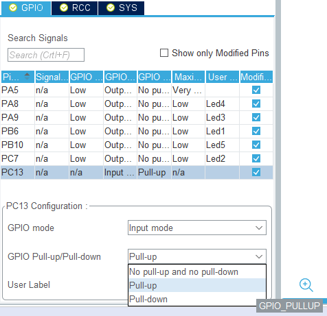

```c

/* Infinite loop */
	/* USER CODE BEGIN WHILE */
	while (1) {

		if (HAL_GPIO_ReadPin(GPIOC, GPIO_PIN_13) == GPIO_PIN_RESET) {
			count++;
			HAL_Delay(10);
		}
			if (count == 1) {
				HAL_GPIO_WritePin(GPIOB, Led1_Pin, GPIO_PIN_SET);
				HAL_GPIO_WritePin(GPIOB, Led2_Pin, GPIO_PIN_RESET);
				HAL_GPIO_WritePin(GPIOA, Led3_Pin, GPIO_PIN_RESET);
			} else if (count == 2) {
				HAL_GPIO_WritePin(GPIOB, Led1_Pin, GPIO_PIN_SET);
				HAL_GPIO_WritePin(GPIOB, Led2_Pin, GPIO_PIN_SET);
				HAL_GPIO_WritePin(GPIOA, Led3_Pin, GPIO_PIN_RESET);
			} else if (count == 3) {
				HAL_GPIO_WritePin(GPIOB, Led1_Pin, GPIO_PIN_SET);
				HAL_GPIO_WritePin(GPIOB, Led2_Pin, GPIO_PIN_SET);
				HAL_GPIO_WritePin(GPIOA, Led3_Pin, GPIO_PIN_SET);
			} else if (count == 4) {
				HAL_GPIO_TogglePin(GPIOB, Led1_Pin);
				HAL_GPIO_TogglePin(GPIOB, Led2_Pin);
				HAL_GPIO_TogglePin(GPIOA, Led3_Pin);
				HAL_Delay(1000); // İstediğiniz değeri ayarlayabilirsiniz. 1 sn = 1000 ms(milisaniye)
			} else if (count == 0) {
				HAL_GPIO_WritePin(GPIOB, Led1_Pin, GPIO_PIN_RESET);
				HAL_GPIO_WritePin(GPIOB, Led2_Pin, GPIO_PIN_RESET);
				HAL_GPIO_WritePin(GPIOA, Led3_Pin, GPIO_PIN_RESET);
			}
			/* USER CODE END WHILE */

			/* USER CODE BEGIN 3 */
			while (HAL_GPIO_ReadPin(GPIOC, GPIO_PIN_13) == RESET) {
				if (count == 4) count = 0;
			}
			HAL_Delay(10);
	}
	/* USER CODE END 3 */
	
```

> Yukarıdaki kodda belki de kafanızı karıştıran kısım `/* USER CODE BEGIN 3 */` ile başlayan **`while`** döngüsü. Burada arktan dolayı programın ilerleyişi bozulmasın diye ilk `RESET`sinyali yakalandıktan sonra döngüye sokuluyor. `RESET` sinyali `SET` olunca döngüden çıkıyor ve sıradaki işlemi gerçekleştiriyor.


>**NOT :** Led1_Pin yazıları sizi yanıltmasın. **CubeMX** içerisinde istediğiniz pine mouse sağ tıklayıp, **User Label** seçildiğinde kendinizde adlandırabiliyorsunuz. Alttaki resimde görüldüğü gibi **`PB6`** pini **`Led1`** olarak adlandırdım.


---

**MIT Lisansı**

[Telif Hakkı (Copyright)](https://github.com/w3eydi/STM32-Egitimi/blob/master/LICENSE) (c) 2020 Eydi Gözeneli - github.com/w3eydi